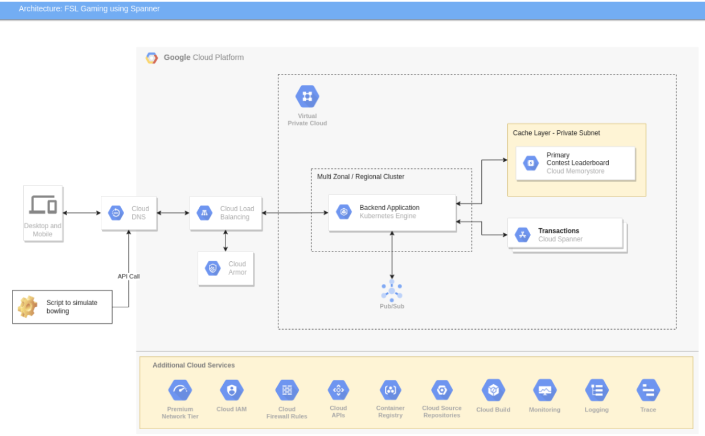
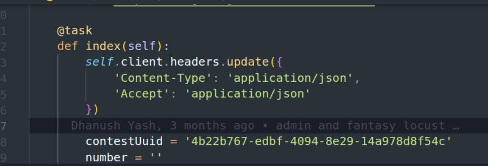
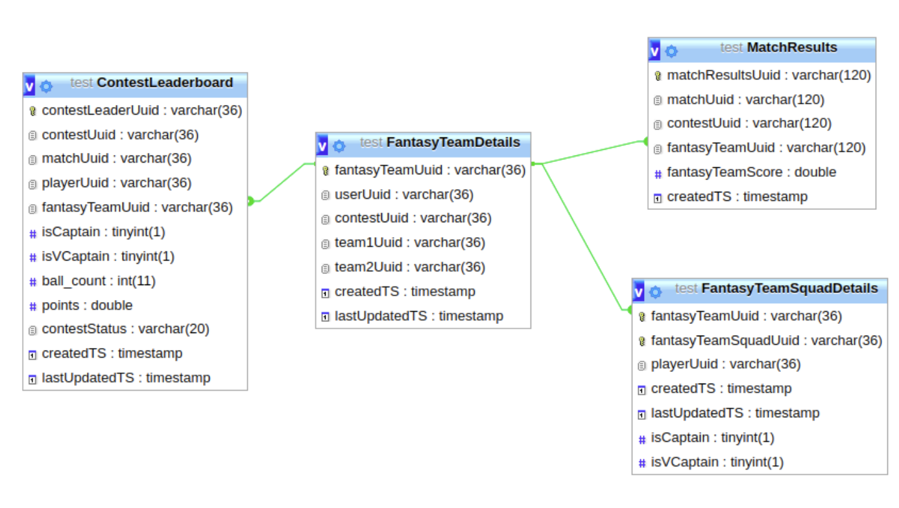

# Fantasy Sports League Game
This repository contains code for a sample FSL game using Cloud Spanner for the backend. There are multiple modules to the game:
- FSL-Backend-Common
- FSL-MS-Display-Leaderboard
- FSL-MS-Resource-Management
- FSL-MS-Simulator
- FSL-MS-Update-Leaderboard
- FSL-Tools
Please follow more detailed Readme's under each of the above git sections.

## Highlevel game architecture

## Resource Management
### Step 1
Use the  /user  API endpoint  from the resource management microservice to add users to the game by making use of the phone number ( must be a 10-digit number).
```API-endpoint : /user
Method: POST
Payload-schema:
{
"mobileNumber": "string"
}
Payload-Example:
	{
 		"mobileNumber": "9756295679"
}
```
Response Example:
```{
  "status": 200,
  "message": "Saved successfully.",
  "data": {
    "mobileNumber": 9756295679,
    "userUuid": "3b96f646-5a5e-409d-bba3-12cbf5015f23",
    "role": "USER"
  		}
}
```
### Step 2
Use the /team API endpoint from the resource management microservice to create a team for the match. And save TeamUuid for creating players. Create at least two teams for a match.
```API-endpoint : /team
Method: POST
Payload-schema: No payload required
```
Response Example:
```{
  "status": 200,
  "message": "Saved successfully.",
  "data": {
    "teamUuid": "10cd0180-a357-41fb-bf24-450b5562f5e9",
    "teamName": "team-0uNoYa",
    "availablePlayers": 16
  }
}
```
### Step 3
To create a player for each team, use the /playersbulk API from the resource management microservice. The Team UuID from the response of the createTeam API should be used as the request payload.
```API-endpoint :  /playersbulk
Method: POST
Payload-schema:
{
 "teamUuid": "string"
}
Payload-Example:
{
  "teamUuid": "10cd0180-a357-41fb-bf24-450b5562f5e9"
}
```
Response Example:
```
{
  "status": 200,
  "message": "Saved successfully.",
  "data": {
    "totalPlayersCreated": 16
  }
}
```
### Step 4
Use the /match API from the resource management microservice to create a match for the two teams by making use of the teamUuid obtained from the createTeam API. You need to pass 2 teamUuid to create a Match.
```API-endpoint :  /match
Method: POST
Payload-schema:
{
  "team1Uuid": "string",
  "team2Uuid": "string"
}
Payload-Example:
{
  "team1Uuid": "10cd0180-a357-41fb-bf24-450b5562f5e9",
  "team2Uuid": "e3771b31-b9b1-4a34-a7c3-2409af0c732d"
}
```
Response Example:
```{
  "status": 200,
  "message": "Saved successfully.",
  "data": {
    "matchUuid": "bd9621dc-71be-4737-914a-9f8159b4555d",
    "team1Uuid": "10cd0180-a357-41fb-bf24-450b5562f5e9",
    "team2Uuid": "e3771b31-b9b1-4a34-a7c3-2409af0c732d",
    "matchTime": "2022-12-22T07:47:54.588Z",
    "matchSTatus": "SCHEDULED",
    "createdTS": "2022-12-22T05:47:54.588Z",
    "lastUpdatedTS": "2022-12-22T05:47:54.588Z"
  }
}
```
### Step 5
Use the /contest API endpoint  from the resource management microservice to create a contest for the match, making use of the MatchUuid.
```API-endpoint :  /contest
Method: POST
Payload-schema:
{
  "matchUuid": "string"
}
Payload-Example:
{
  "matchUuid": "bd9621dc-71be-4737-914a-9f8159b4555d"
}
```
Response Example:
```{
  "status": 200,
  "message": "Saved successfully.",
  "data": {
    "contestUuid": "045a4c2f-44a0-4f86-9cd7-a526dcb67b83",
    "matchUuid": "bd9621dc-71be-4737-914a-9f8159b4555d",
    "team1Uuid": "10cd0180-a357-41fb-bf24-450b5562f5e9",
    "team2Uuid": "e3771b31-b9b1-4a34-a7c3-2409af0c732d",
    "slot": 968614,
    "contestStatus": "SCHEDULED"
  }
}
```
### Step 6
Use the /fantasy-team-details API from the resource management microservice to create a fantasy team for the contest, making use of the UserUuid and ContestUuid.
```API-endpoint :  /fantasy-team-details
Method: POST
Payload-schema:
{
  "userUuid": "string",
  "contestUuid": "string"
}
Payload-Example:
{
  "userUuid": "3b96f646-5a5e-409d-bba3-12cbf5015f23",
  "contestUuid": "045a4c2f-44a0-4f86-9cd7-a526dcb67b83"
}
```
Response Example:
```{
  "status": 200,
  "message": "Saved successfully.",
  "data": {
    "fantasyTeamUuid": "4c210626-29a5-46f8-8b23-4815f10d4be7",
    "userUuid": "3b96f646-5a5e-409d-bba3-12cbf5015f23",
    "contestUuid": "045a4c2f-44a0-4f86-9cd7-a526dcb67b83",
    "team1Uuid": "10cd0180-a357-41fb-bf24-450b5562f5e9",
    "team2Uuid": "e3771b31-b9b1-4a34-a7c3-2409af0c732d"
  }
}
```
### Step 7
Use /fantasy-team-squad-details-bulk  API endpoint to create playing 11 for the fantasy team
```API-endpoint :  /fantasy-team-squad-details-bulk
Method: POST
Payload-Example:
{
  "fantasyTeamUuid": "string"
}
```
Response Example:
```{
  "status": 200,
  "message": "Saved successfully.",
  "data": {
    "fantasyTeamUuid": "4c210626-29a5-46f8-8b23-4815f10d4be7",
    "userUuid": "3b96f646-5a5e-409d-bba3-12cbf5015f23",
    "contestUuid": "045a4c2f-44a0-4f86-9cd7-a526dcb67b83",
    "team1Uuid": "10cd0180-a357-41fb-bf24-450b5562f5e9",
    "team2Uuid": "e3771b31-b9b1-4a34-a7c3-2409af0c732d"
  }
}
```
## FSL-Tools
### Steps
Use locust to add the more fantasy team for a contest.
- Prerequisite to run locust scripts
  * Python 3.7 or above
  * Locust [click here](https://docs.locust.io/en/stable/installation.html)
- From the git repo checkout to FSL-tools folder. Open FantasyFlow.py file update the contestUuid to new contestUuid obtained from create contest API

- To run the script use the command locust FantasyFlow.py

## FSL-MS-Simulator
### Step:
Use the /simulate-match API from the Simulator Microservice to simulate the entire match using the match Id
```API-endpoint :  /simulate-match
Method: POST
Payload-Example:
{
  "match_id": "string"
}
```
Response Example:
```{
  "status": 200,
  "message": "Saved successfully.",
  "data": {
    "matchUuid": "bd9621dc-71be-4737-914a-9f8159b4555d",
    "contestStatus": "IN-PROGRESS"
  }
}
```
## Entity Relationship diagram



